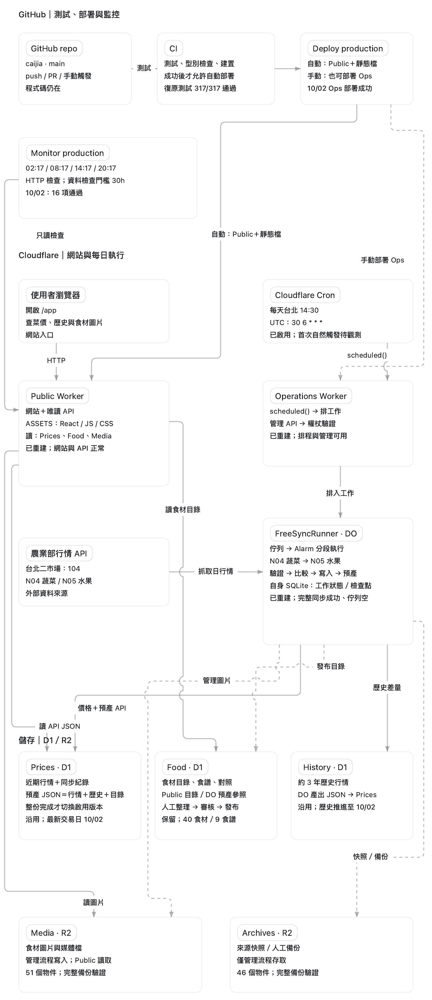

<h1 align="center">菜價有感</h1>

  <strong>菜價有感的公開開發日記</strong> 
  從「這把菜算貴嗎？」出發，記錄產品、架構與每一次取捨。

  
  
  
  

  <a href="https://caijia-public-production.chiu-dev.workers.dev/app/">開啟菜價有感 ↗</a> ·
  <a href="#architecture">系統架構</a> ·
  <a href="#devlog">開發日記</a>

---

看到地瓜葉 45 元，單看數字，很難知道它算貴還是便宜。菜價有感用農業部臺北二批發市場的行情，讓價格有近期與歷史的比較基準，再接著回答食材怎麼挑、怎麼吃。

這裡記錄把這個想法做成服務的過程。**網站呈現的是批發拍賣行情，並非攤商或超市的實付零售價。**

## 一張圖看懂系統

2026/10/02 復原後的架構快照。實線表示主要流程，虛線表示手動管理；點開圖片可放大閱讀。

可以沿著三條路讀這張圖：

- **有人開網站時**：Public Worker 提供網頁與唯讀 API，讀取已發布的行情、食材目錄與圖片。
- **每天更新行情時**：台北時間 14:30，Cron 觸發 Operations Worker，交給 FreeSyncRunner（Durable Object）分段抓取蔬菜與水果行情、更新 D1，再產出網站使用的查詢結果。
- **修改程式或檢查服務時**：GitHub Actions 負責測試與部署；Monitor production 每六小時檢查網站、API 與更新狀態。

Worker 是執行程式的地方，D1 保存資料，R2 保存檔案。FreeSyncRunner 自己還有工作佇列與檢查點；它的 SQLite 與三個 D1 是不同的儲存空間。

Prices 保存行情與預先產生的 API JSON；History 保存歷史資料；Food 保存食材內容。Media 放公開圖片，Archives 放管理流程使用的快照與備份。食材與圖片由人工管理流程發布，每日排程只更新行情。

目前的幾個取捨：

| 決策 | 原因與代價 |
| --- | --- |
| 網站與同步分成兩支 Worker | 分開服務讀取與後台寫入，也多了一組部署設定。 |
| 同步分段執行、留下檢查點 | 配合 Workers Free 的執行限制，失敗後可以續跑；需要管理佇列與重試。 |
| 完整產出查詢 JSON 後才切換版本 | 網站讀取快速，避免拿到一半更新的資料；更新流程因此多了預產與驗證。 |

## 2026/10/02：找回消失的執行層

這次查核發現，兩支 Worker 與 Durable Object 命名空間已經不存在，但三個 D1 與兩個 R2 的資料仍在。網站入口與每日同步缺的是執行者，因此先保留既有資料，備份後重建執行層。

復原後，手動完成一輪蔬菜與水果同步，網站與 API 恢復正常；317 項測試與 16 項正式站監控檢查通過。每日排程也已重新啟用，**這份紀錄尚未驗證重建後的第一次自然 Cron 觸發**。

這次留下的提醒是：**資料還在、程式部署成功、資料同步成功，是三件需要分別確認的事。**

下一個想釐清的問題，是上游實際多久更新，以及錯過一次更新的影響。先弄清楚這兩件事，再決定每天抓價與每六小時監控是否值得保留。

---

程式開發保留在 private repo；`caijia-devlog` 公開整理後的故事、決策與圖片。目前先用這一份 README 持續記錄。
